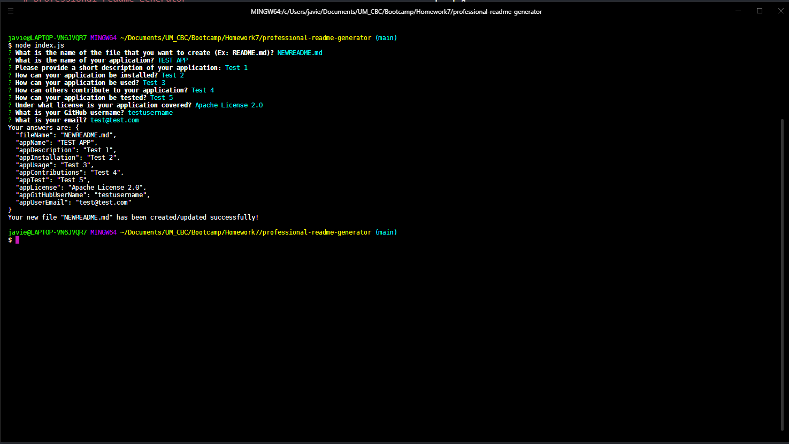

# professional-readme-generator

## Summary:
This is a terminal application that creates a readme.md file with the name provided by the user. It will present several questions, like how to install the application, how to use it, under what license is covered, etc., and write a new .md file based on the user answers.

## Video Demo:
https://drive.google.com/file/d/1Wkt7KW1p-pLOLsRcqbYyyrNqpnq0SDxy/view

## Image:

